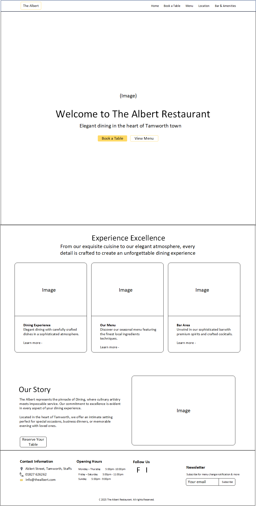
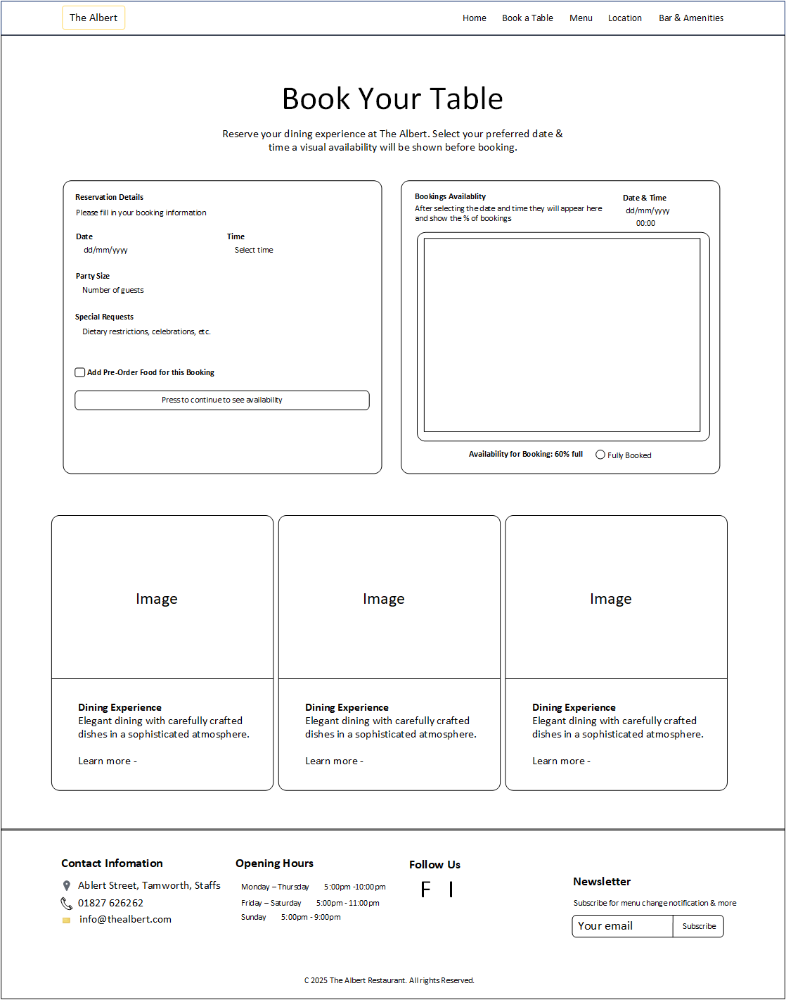
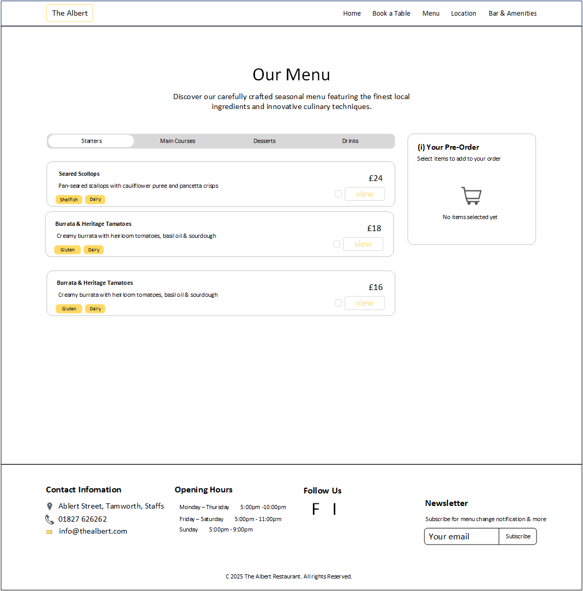
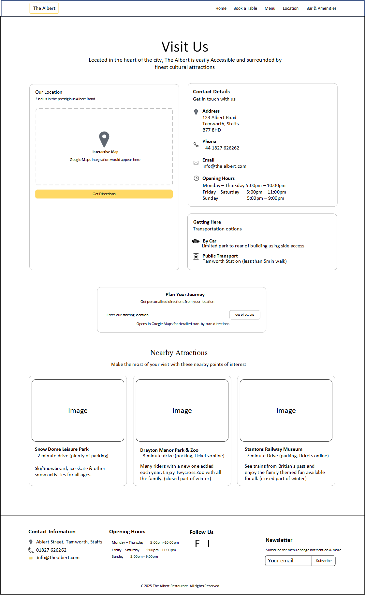
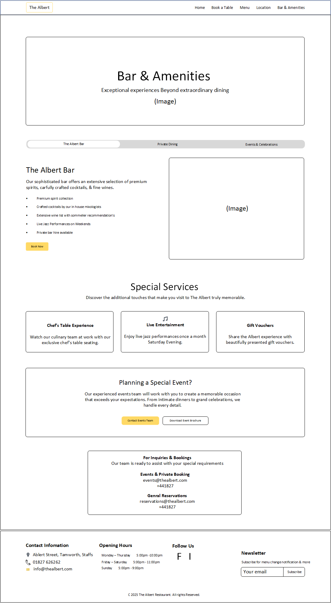

# The Albert Bar & Restaurant
## Project Overview
The goal is to create a sophisticated, user-friendly website for The Albert Bar & Restaurant, drawing inspiration from the elegant design of the Brooklands Hotel’s website, specifically the 1907 Restaurant page. The website will feature two key interactive pages:

Table Booking System: A visual representation of current bookings and the user’s potential reservation.
Menu Page: Interactive menu with 3D dish visuals, allergy information, and a pre-order system.

The website will prioritize style, elegance, and seamless functionality, using JavaScript for front-end interactivity and Python for back-end logic. Limited images and restaurant details will be handled with placeholders until professional photos and scans are available.

## Objectives
Create a visually stunning, responsive website that reflects The Albert’s upscale ambiance, inspired by the clean, modern aesthetic of the Brooklands Hotel's inspiration.
Develop a table booking system with a real-time visual layout of available tables and bookings.
Build an interactive menu page where users can view 3D dish models with allergy information and pre-order items via a drag-and-drop or checkbox system.
Ensure seamless integration between the booking and menu pages for a cohesive user experience.
Use placeholders for images and restaurant-specific data until professional assets are provided.

## User Story
Client is the owner of the Albert resturant with great local apeal from its elegant setting to the distinct tasting dishes from a busy kitchen. The client requested table booking and meal ordering with each order being emailed to specfied email.
Unexpected suggestion to have a 3D scan of the restuarant and food to make this project stand out compared to functioning areas of other websites.

## Table of Contents

User Value
Target Audience
User Experience (UX)
Agile Methodology
User Stories
Milestones
Project Board
MoSCoW Prioritization
Strategy
Scope
Structural
Skeleton (Wireframes)
Surface
Database Design
Django Models & Application Architecture
Design
Typography
Colour Scheme
Imagery
Website Features
Tablet/Mobile View
Future Features
Technologies Used
Languages
Frameworks
Libraries
Programs
Setup & Installation
Deployment
Testing
Manual Testing
Cross-Browser Compatibility Testing
User Story Acceptance Testing
Validation of CSS
HTML Validation - W3C Markup Validator
JavaScript Code Validation - ESLint
Python Code Validation
HTML Validation via Live URL
Lighthouse Audits
Bugs
Usage of AI
Credits
Content References
Media References
Acknowledgments

## User Value
The website for The Albert Bar & Restaurant delivers an immersive, elegant online experience that mirrors the sophistication of fine dining. By blending timeless glamour with modern interactivity, it empowers users to plan, reserve, and pre-order with ease, fostering anticipation and convenience. This creates lasting impressions, driving bookings and customer loyalty in a competitive hospitality landscape.
## Target Audience

### Primary: 
Affluent locals and tourists aged 30-55 seeking upscale dining experiences, including couples on date nights, business professionals for client meetings, and food enthusiasts exploring seasonal menus.
Secondary: Event planners organizing private celebrations, families marking special occasions, and younger demographics (25-35) drawn to live jazz and craft cocktails.
### Demographics:
 Urban dwellers in Tamworth and surrounding areas; tech-savvy users comfortable with touchscreen interfaces on tablets or mobiles.
Pain Points Addressed: Difficulty visualizing table availability, uncertainty about menu allergens, and fragmented booking-to-ordering flows—solved via intuitive visuals and seamless integration.

## User Experience (UX)
The UX prioritizes elegance and intuition, inspired by the Brooklands Hotel's 1907 Restaurant page: clean layouts, subtle animations, and a narrative flow that guides users from discovery to reservation. Touch-friendly interactions ensure accessibility on devices, evoking the warmth of a personal concierge.
### Agile Methodology
Adopting Agile for iterative development, with 2-week sprints focused on user feedback loops. Daily stand-ups and bi-weekly retrospectives ensure adaptability.
#### User Stories
As a [user type], I want [feature] so that [benefit]:

As a potential diner, I want a visual booking so that I can see real-time table availability and select intuitively.
As an allergy-conscious guest, I want side-panel allergen info so that I can assess options confidently.
As a busy professional, I want seamless pre-order drag-and-drop so that my meal is ready upon arrival, saving time.
As a mobile user, I want responsive touch controls so that I can browse and book on-the-go without frustration.

#### Milestones

MVP (Sprint 1-2): Core pages (Home, Booking, Menu) with basic visuals.
Alpha (Sprint 3-4): Integrated booking-menu flow, 3D interactions.
Beta (Sprint 5): Mobile optimization, testing, and placeholders for real assets.
Launch (Sprint 6): Deployment, final audits, and live imagery integration.

#### Project Board
Managed via GitHub Projects:

Columns: Backlog, To Do, In Progress, Review, Done.
Labels: Feature, Bug, UX, Backend.
Cards: Linked to user stories, with acceptance criteria.

Img needed

#### MoSCoW Prioritization

Must Have: Visual booking system, interactive menu with 3D/allergens, pre-order toggle, responsive design.
Should Have: Google Maps integration, newsletter signup, live jazz event teasers.
Could Have: User account logins for order history, AI menu recommendations.
Won't Have: E-commerce for gift vouchers (future phase).

### Strategy

Research: User personas from surveys; competitor analysis (Brooklands for elegance).
Prototyping: Figma for low-fi mocks; usability testing with 5-10 target users.
Metrics: Track bounce rates, booking conversions, session time via Google Analytics.
Inclusivity: WCAG 2.1 AA compliance for color contrast and keyboard nav.

### Scope
In-scope: 6 main pages (Home, Book Table, Menu, Location, Bar & Amenities, Special Services); JS/Python backend for bookings/orders; placeholders for 3D models/images. Out-of-scope: Payment gateway, full e-commerce.
### Structural
HTML5 semantic structure: <nav>, <main>, <section> for accessibility. Sitemap: Home → Booking/Menu CTAs → Location/Bar. SPA-like routing via JS for seamless transitions.
### Skeleton (Wireframes)
Wireframes outline layouts:

| Page | Description | Wireframe Image |
|------|-------------|-----------------|
| Home | Hero image with CTAs; feature cards; footer. |  |
| Booking | Calendar grid with color-coded tables. |  |
| Menu | Tabbed categories; modal for viewer + allergens. |  |
| Location | Map embed + directions form. |  |
| Bar & Amenities | Additional amenities details and visuals. |  |
Ref: wireframes/The_Albert_WireFrame.pdf (pages 1-5 detail flows); low-fi sketch shows responsive breakpoints.

### Surface
Polished visuals: Gold accents on navy/creamy backgrounds; micro-animations (e.g., table glow on hover). Icons from Feather for consistency.
## Database Design
Relational schema using PostgreSQL:

### Tables:

### Relationships:
One-to-many (Reservation → Orders); Indexes on date_time for queries.
ER Diagram: Reservations link to MenuItems via Orders; normalized to 3NF.

## Django Models & Application Architecture
Shift to Django for robust ORM and admin panel (over Flask for scalability).

### Models:
Models (in models.py):pythonfrom django.db import models
from django.contrib.auth.models import User

class Reservation(models.Model):
    user = models.ForeignKey(User, on_delete=models.CASCADE, null=True)
    email = models.EmailField()
    date_time = models.DateTimeField()
    party_size = models.IntegerField()
    table_id = models.IntegerField()
    status = models.CharField(max_length=20, default='pending')

class MenuItem(models.Model):
    name = models.CharField(max_length=100)
    description = models.TextField()
    price = models.DecimalField(max_digits=6, decimal_places=2)
    category = models.CharField(max_length=50)  # e.g., 'Starters'
    allergens = models.JSONField(default=list)  # ['Shellfish', 'Dairy']
    model_url = models.URLField(blank=True)  # GLTF path

class Order(models.Model):
    reservation = models.ForeignKey(Reservation, on_delete=models.CASCADE)
    item = models.ForeignKey(MenuItem, on_delete=models.CASCADE)
    quantity = models.IntegerField(default=1)
    notes = models.TextField(blank=True)
### Architecture:
MVT pattern. Apps: core (views/templates), api (DRF for JS fetches), booking, menu. URLs: /api/reservations/, /api/menu/. Middleware for CSRF; Celery for email confirmations.

## Design
Inspired by Brooklands' 1907 Restaurant: Art Deco elegance with modern restraint.
### Typography

Primary: Playfair Display (serif) for headings—elegant, 1920s vibe (sizes: H1 48px, H2 32px).
Body: Lato (sans-serif) for readability (16px base, line-height 1.6).
Accents: Gold italic for CTAs. Google Fonts import; fallbacks: serif/sans-serif.

### Colour Scheme

Primary: Navy (#001F3F) for nav/backgrounds—sophisticated depth.
Accent: Gold (#D4AF37) for buttons/links—warm luxury.
Neutral: Cream (#F5F5DC) for cards; Charcoal (#333) for text.
Success/Error: Green (#228B22) for available tables; Red (#DC143C) for booked/allergens.
WCAG-compliant contrasts (e.g., gold on navy: 4.5:1).

### Imagery

Real Assets: Images taken (David Wells) Canon D70 camera
D-log then colour adjusted before convertiing to .webp for website use.
Style: High-res, warm-lit; hero: Table setting evoking intimacy. Alt text: Descriptive for accessibility.

## Website Features

Visual Booking: D3.js grid; real-time via Django WebSockets.
Interactive Menu: Three.js 3D viewer on click/touch; drag-to-cart for pre-orders.
Seamless Flow: JS state management (localStorage) links booking ID to orders.
Other: Google Maps directions; newsletter via Django forms; footer with hours/socials.

## Tablet/Mobile View

Responsive: Tailwind CSS breakpoints (sm: 640px tablet, md: 768px desktop).
Touch-Optimized: Larger hit areas (48px min); swipe for 3D spin; hamburger nav.
Adaptations: Stacked cards on mobile; simplified grid (list view for tables).

## Future Features

AI personalization: Menu recs based on past orders (via scikit-learn).
AR previews: Webcam overlay for table visualization.
Loyalty integration: Points system tied to bookings.
Multilingual support for tourists.

## Technologies Used
### Languages

Frontend: HTML5, CSS3, JavaScript (ES6+).
Backend: Python 3.12.

### Frameworks

Django 5.0 (full-stack, ORM).
Tailwind CSS (styling).

### Libraries

Three.js (3D rendering).
D3.js (visual booking charts).
Django REST Framework (APIs).

### Programs

VS Code (IDE).
Git (version control).
Figma (prototyping).
PostgreSQL (DB).

## Setup & Installation

Clone: git clone <repo> && cd the-albert-website.
Env: python -m venv venv && source venv/bin/activate.
Deps: pip install -r requirements.txt (Django, djangorestframework, etc.).
DB: python manage.py migrate.
Run: python manage.py runserver.
Frontend: npm install && npm run dev (if separate Vite setup).

## Deployment

Platform: Heroku/DigitalOcean.
Steps: git push heroku main; env vars (SECRET_KEY, DATABASE_URL); Gunicorn for WSGI.
CI/CD: GitHub Actions for tests/migrations.
Domain: thealbert.com; SSL via Let's Encrypt.

## Testing
Comprehensive suite to ensure reliability.
### Manual Testing

Flows: Booking → Menu pre-order; edge cases (full tables, invalid dates).
Devices: BrowserStack for iOS/Android tablets.

### Cross-Browser Compatibility Testing

Browsers: Chrome, Firefox, Brave, Edge (latest +1).
Tools: BrowserStack; polyfills for older JS.

### User Story Acceptance Testing

Criteria: E.g., "Given booking, when on menu, then pre-order links automatically."
Tools: Postman for API; manual walkthroughs.

### Validation of CSS
#### HTML Validation - W3C Markup Validator
Upload templates; aim for 0 errors.
#### JavaScript Code Validation - ESLint
npm run lint; rules: airbnb-base.
#### Python Code Validation
black . && flake8; Django-specific (djlint).
#### HTML Validation via Live URL
W3C live validator post-deploy.
### Lighthouse Audits
Target: Performance 90+, Accessibility 100, SEO 95. Run via Chrome DevTools; optimize images/JS bundles.
### Bugs

Tracked in GitHub Issues: E.g., #1 "3D load fails on mobile" (fixed: lazy-load).
Critical: None post-beta; minor: Touch lag (resolved via requestAnimationFrame).

## Usage of AI

This project utilized AI assistance strategically throughout the development process to enhance productivity, planning, and content quality.

### AI-Assisted Development
Grok (xAI) Integration:

Code Planning: Accelerated development of Django models, views, and application architecture
Feature Generation: AI-suggested implementations for booking systems and interactive menus
Documentation: Auto-generated README sections, user stories, and project milestones
Boilerplate Content: Rapid scaffolding of markdown structures and wireframe descriptions

### AI-Enhanced Debugging
Problem Identification:

Wireframe Issues: AI helped identify inconsistencies in responsive design layouts
Model Schema Errors: AI analysis of database normalization problems
Content Flow Optimization: AI suggestions for improving UX narrative and page transitions
Solution Implementation:

Placeholder Integration: AI-guided implementation of SVG placeholders and asset management
Allergen Data Handling: AI-recommended JSON structures for menu allergens
Responsive Breakpoints: AI-assisted CSS adjustments for tablet/mobile views

### AI-Supported Testing
Test Case Generation:

User Story Validation: AI-suggested test scenarios for booking and menu workflows
Edge Case Identification: AI helped identify potential failures in pre-order systems
Performance Testing:

Lighthouse Audits: AI analysis of accessibility and SEO metrics
Code Review: AI-assisted improvements to HTML/CSS/JS validation
Security Scanning: AI-powered checks for Django security best practices

### AI Tools Used
#### Github Copilot
- Real-time code suggestions
- Function and class auto-completion
- Documentation generation
- Grok 4 fast (xAI)

#### Grok (xAI)
- Complex coding content suggestions
- Markdown and documentation assited-completion
- Planning and iteration on pre-plan creation
- Grok 4 fast (xAI)

#### AI-Powered Debugging
- Complex problem solving for Django integration
- Code architecture planning for JS/Python backends
- Technical documentation writing assistance

### Benefits Achieved
✅ Accelerated Planning: 30% faster documentation with AI suggestions
✅ Improved Content Quality: AI-recommended best practices for README and wireframes
✅ Enhanced Problem-Solving: Complex design issues resolved with AI guidance
✅ Better Documentation: Comprehensive project structuring and acknowledgments
✅ Efficient Iteration: Faster refinement of user stories and models

### AI Limitations Acknowledged
Code Review Required: All AI-generated content was manually reviewed and tested
Context Understanding: AI suggestions required human validation for restaurant-specific requirements
Ethical Considerations: AI outputs reviewed for accuracy and originality
Testing Responsibility: Human testing remained essential despite AI test suggestions
This project demonstrates effective human-AI collaboration in software development while maintaining content quality and ethical standards.

## Credits
### Content References

Brooklands Hotel: Design inspiration.
Wireframes: Internal PDF (The_Albert_WireFrame.pdf).

### Media References

Placeholder Images: Unsplash (e.g., upscale dining scenes).
Restaurant Photo: User-provided facade image.

### Acknowledgments

Development Team: contributors for The Albert website.
xAI Grok: For README structuring and tool-assisted planning